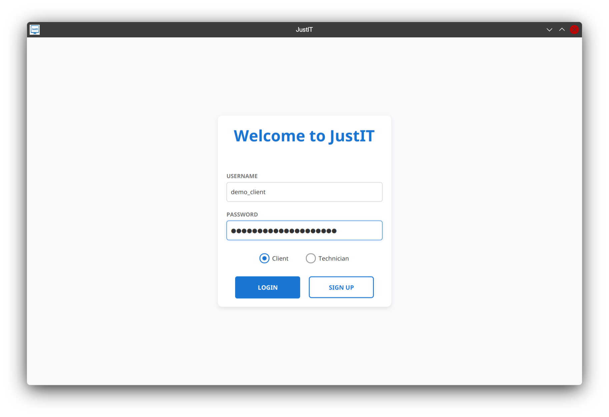
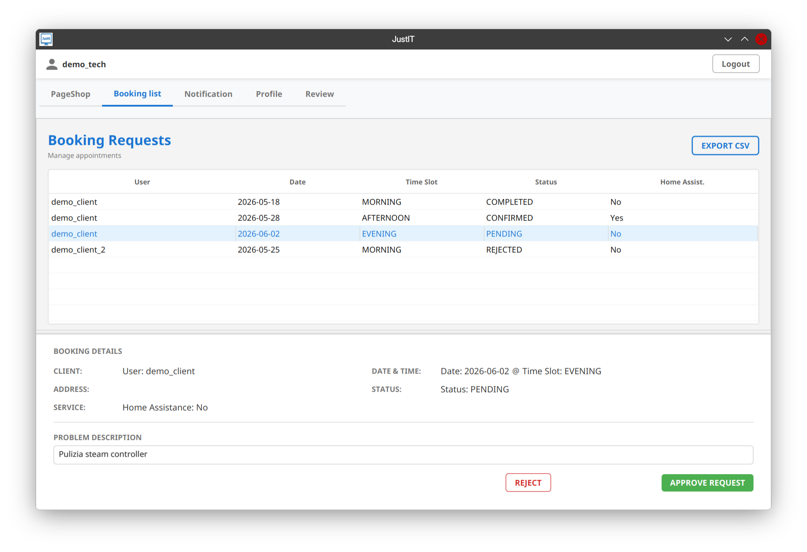
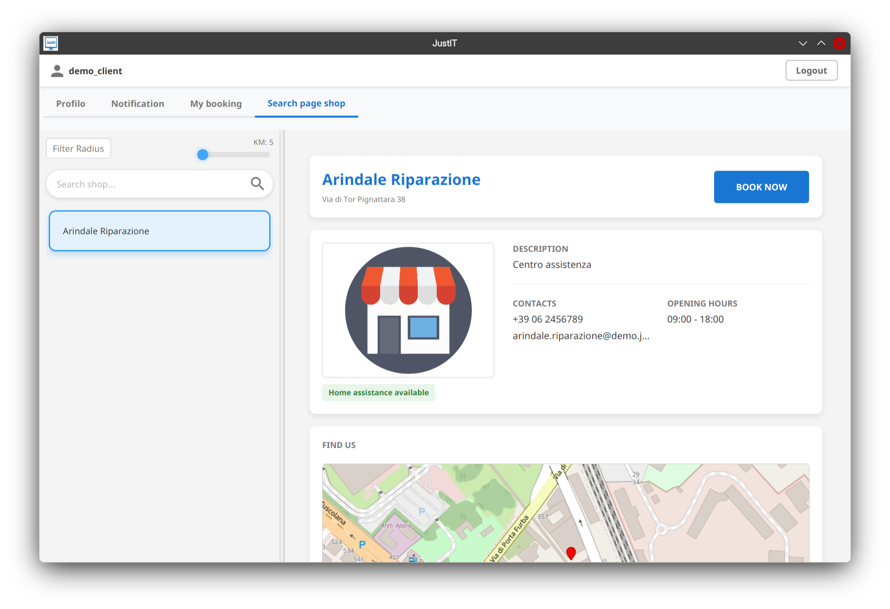
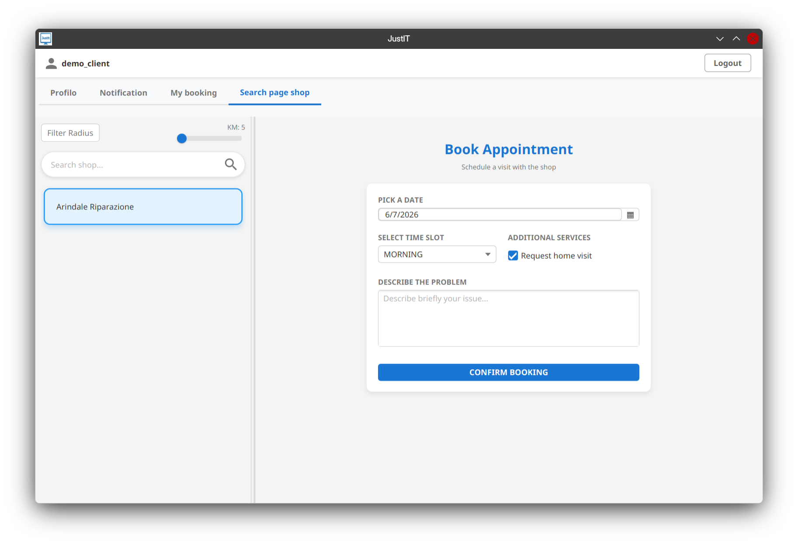
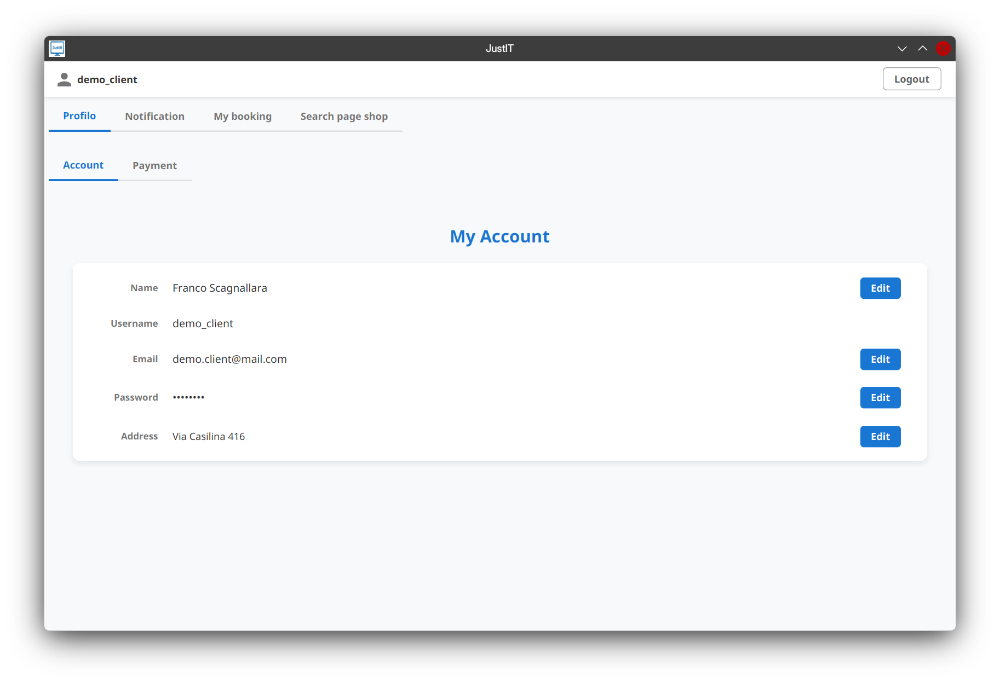
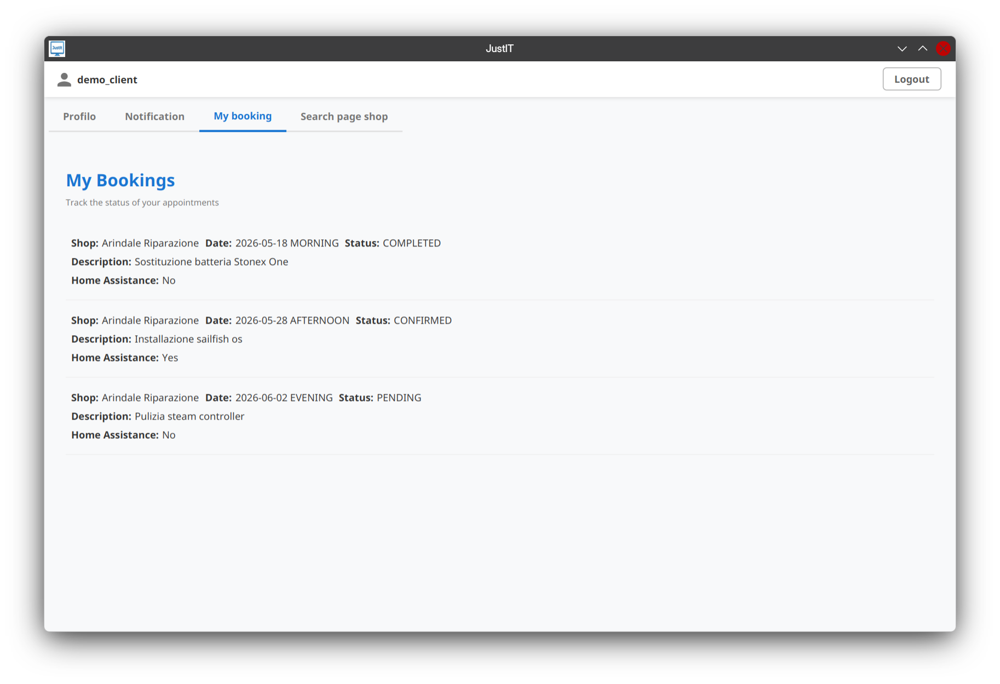

#  JustIT
[](http://www.wtfpl.net/about/)
[](...)
[](...)
[](...)
[](...)

JustIT is a Java desktop application developed for the *Ingegneria del Software e Programmazione Web _(Software Engineering and Web Programming)_* course at the *University of Rome Tor Vergata*.

## Overview
JustIT provides a platform for managing technical shop appointments, allowing customers and technicians to interact through booking workflows.

The system supports two different user roles:

- **Customers**
- **Technicians**

The system follows the **MVC architectural pattern**, is developed with **Maven**, and provides two different user interfaces:

- JavaFX and FXML files.
- Standard Command Line Interface.

The application can run in two different modes:

- **Demo Mode**: execution using in-memory persistence with volatile data.
- **Full Mode**: execution using persistent storage through SQLite or JSON files.

## Features 

### Customer Features

- Account management.
- Browse available technical shops.
- Search shops based on location.
- Book technical appointments.
- View and manage personal bookings.
- Review completed services.
- Simulated payment operations.


### Technician Features

- Manage technical shop information.
- View incoming bookings.
- Manage appointment status.
- Complete repair reports.
- Export booking calendar to CSV.


## Technologies
The project is developed using:

- Java
- JavaFX and FXML
- Maven
- SQLite
- JDBC
- JSON persistence

### Persistence Layer

JustIT supports multiple persistence backends.

Available persistence modes:

- **SQLite database**
- **JSON file system**
- **In-memory storage for Demo Mode**

### External Integrations

- **OpenStreetMap Nominatim API** for geocoding addresses and location-based shop search.
- **Mock Visa and Mastercard payment gateways** used to simulate payment and refund operations.

### Design Patterns
- Observer
- Factory Method
- State pattern
- Singleton

## Project Structure

```
justit/
├── src/
│   ├── main/
│   │   ├── java/
│   │   │   └── it/dosti/justit/
│   │   │       ├── api/                  # API
│   │   │       ├── bean/                 # Data transfer beans
│   │   │       │   └── mapper/             # Bean/Domain mapping utilities
│   │   │       ├── controller/
│   │   │       │   ├── app/              # Application controllers
│   │   │       │   └── graphical/        # Graphical controllers
│   │   │       │       ├── cli/          
│   │   │       │       └── gui/          
│   │   │       ├── dao/                  # Data Access Objects
│   │   │       ├── db/                   # Database layer
│   │   │       │   └── query/              # SQL queries
│   │   │       ├── dto/                  # Data Transfer Objects
│   │   │       ├── events/               
│   │   │       │   └── publisher/        # Publisher-subscriber pattern
│   │   │       ├── exceptions/           # Custom exceptions
│   │   │       ├── model/                # Business model
│   │   │       └── ui/                     # UI utilities
│   │   │           └── navigation/       
│   │   └── resources/
│   │       ├── DB/                      # Database files
│   │       │   └── justit.db             # SQLite database
│   │       ├── *.fxml                   # JavaFX files
│   └── test/                            
│       └── java/it/dosti/justit/
├── doc/                                 # Project documentation
│   ├── activity_diagram/
│   ├── class_diagram/
│   ├── project_document/
│   │   └── typst/                      # Typst source
│   ├── sequence_diagram/
│   ├── state_diagram/
│   └── use_case_diagram/                            
├── pom.xml                              # Maven configuration
└── README.md
```

## Running

The application supports different execution options through command-line arguments:

| Argument  | Description |
|-----------|-------------|
| *default* | Starts the JavaFX graphical interface using SQLite persistence |
| `--cli`   | Starts the Command Line Interface |
| `--demo`  | Uses in-memory persistence with demo data |
| `--fs`    | Uses JSON file-system persistence |

### Demo Accounts
The following accounts can be used to test the application.

#### Demo Mode

| Role | Username    | Password |
|------|-------------|----------|
| Customer | demo_client | password |
| Technician | demo_tech      | password |

#### Full Mode (SQLite)

| Role | Username | Password |
|------|----------|----------|
| Customer | demo     | password |
| Technician | tec.demo | password |


## Screenshot
<p float="left">
    
  
  
  
  
  
</p>

## License

```
DO WHAT THE FUCK YOU WANT TO PUBLIC LICENSE
                    Version 2, December 2004

 Copyright (C) 2026 DOSTI
 Everyone is permitted to copy and distribute verbatim or modified
 copies of this license document, and changing it is allowed as long
 as the name is changed.

            DO WHAT THE FUCK YOU WANT TO PUBLIC LICENSE
   TERMS AND CONDITIONS FOR COPYING, DISTRIBUTION AND MODIFICATION

  0. You just DO WHAT THE FUCK YOU WANT TO.
```


## Authors

- Giulio Rustia
- Valerio Mazza

**Year:** 2026