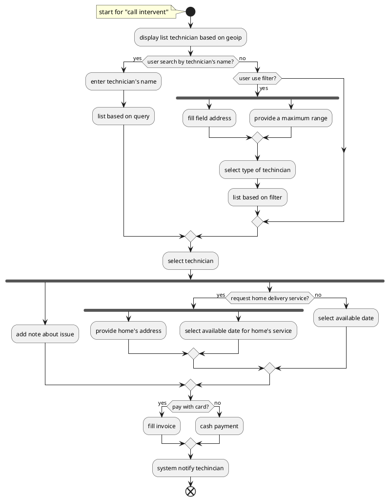

```plantuml
@startuml

start
note
start for "call intervent"
end note

:display list technician based on geoip;

if (user search by technician's name?) then (yes)
    :enter technician's name;
    :list based on query;
else (no)
    if (user use filter?) then (yes)
    fork
        :fill field address;
    fork again
        :provide a maximum range;
    end merge

    :select type of techincian;

    :list based on filter;


endif
endif

:select technician;

fork
    :add note about issue;
fork again
    if (request home delivery service?) then (yes)
        fork
            :provide home's address;
        fork again
            :select available date for home's service;
        end merge
    else (no)
        :select available date;
    endif
end merge

if (pay with card?) then (yes)
    :fill invoice;
else (no)
    :cash payment;
endif

:system notify techincian;

end

@enduml
```
