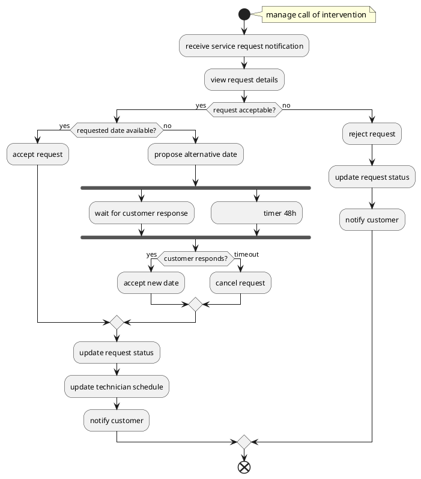

```plantuml
@startuml
start

note right
manage call of intervention
end note

:receive service request notification;
:view request details;

if (request acceptable?) then (yes)

    if (requested date available?) then (yes)
        :accept request;
    else (no)
        :propose alternative date;
        fork
            :wait for customer response;
            
        fork again
        
            :\t\t\t timer 48h; <<timeEvent>>
            
        end fork
        
        if (customer responds?) then (yes)
                :accept new date;
            else (timeout)
                :cancel request;
        endif
        
    endif

    :update request status;
    :update technician schedule;
    :notify customer;

else (no)

    :reject request;
    :update request status;
    :notify customer;

endif

end
@enduml
```
