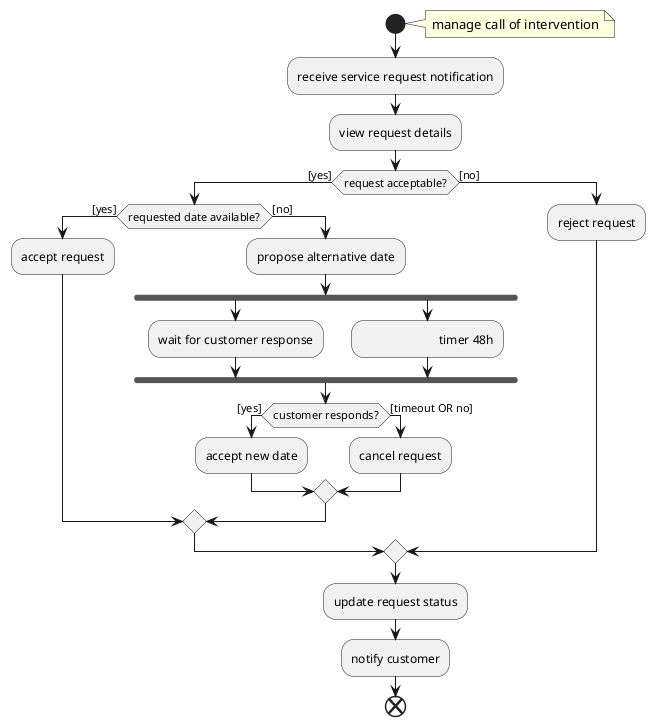

```plantuml
@startuml
start

note right
manage call of intervention
end note

:receive service request notification;
:view request details;

if (request acceptable?) then ([yes])

    if (requested date available?) then ([yes])
        :accept request;
    else ([no])
        :propose alternative date;
        fork
            :wait for customer response;
            
        fork again
        
            :\t\t\t timer 48h; <<timeEvent>>
            
        end fork
        
        if (customer responds?) then ([yes])
                :accept new date;
            else ([timeout OR no])
                :cancel request;
        
        endif
        
    endif


else ([no])

    :reject request;


endif

:update request status;
:notify customer;

end
@enduml
```
