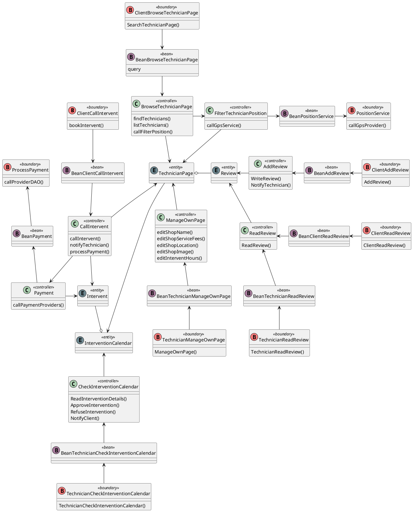

```plantuml
@startuml
class   ClientCallIntervent             <<(B,#FF7F7F)boundary>>{
bookIntervent()
}

class   BeanBrowseTechnicianPage             <<(B,#AA7E9F)bean>>{
query
}

class   BeanPositionService             <<(B,#AA7E9F)bean>>{

}
class   BeanAddReview             <<(B,#AA7E9F)bean>>{

}

class   BeanClientCallIntervent             <<(B,#AA7E9F)bean>>{

}

class   BeanPayment             <<(B,#AA7E9F)bean>>{

}

class   BeanTechnicianManageOwnPage             <<(B,#AA7E9F)bean>>{

}

class   BeanTechnicianCheckInterventionCalendar             <<(B,#AA7E9F)bean>>{

}

class   BeanClientReadReview             <<(B,#AA7E9F)bean>>{

}

class   BeanTechnicianReadReview             <<(B,#AA7E9F)bean>>{

}

class   CallIntervent                   <<controller>>{
callIntervent()
notifyTechnician()
processPayment()
}

class   TechnicianPage                  <<(E,#708a93)entity>>
class   Payment                         <<controller>>{
callPaymentProviders()
}
class   ProcessPayment                  <<(B,#FF7F7F)boundary>>{
callProviderDAO()
}
class   ClientBrowseTechnicianPage      <<(B,#FF7F7F)boundary>>{
SearchTechnicianPage()
}
class   BrowseTechnicianPage            <<controller>>{
findTechnicians()
listTechnicians()
callFilterPosition()
}
class   FilterTechnicianPosition        <<controller>>{
callGpsService()
}
class   PositionService                 <<(B,#FF7F7F)boundary>>{
callGpsProvider()
}
class   ManageOwnPage                   <<controller>>{
editShopName()
editShopServiceFees()
editShopLocation()
editShopImage()
editInterventHours()
}
class   TechnicianManageOwnPage         <<(B,#FF7F7F)boundary>>{
ManageOwnPage()
}
class   CheckInterventionCalendar                  <<controller>>{
ReadInterventionDetails()
ApproveIntervention()
RefuseIntervention()
NotifyClient()
}
class   Intervent                       <<(E,#708a93)entity>>
class   ClientAddReview                 <<(B,#FF7F7F)boundary>> {
AddReview()
}
class   ClientReadReview                <<(B,#FF7F7F)boundary>>{
ClientReadReview()
}
class   AddReview                       <<controller>>{
WriteReview()
NotifyTechnician()
}
class   Review                          <<(E,#708a93)entity>>
class   ReadReview                      <<controller>>{
ReadReview()
}

class TechnicianReadReview              <<(B,#FF7F7F) boundary>>{
TechnicianReadReview()
}
class TechnicianCheckInterventionCalendar <<(B,#FF7F7F) boundary>>{
TechnicianCheckInterventionCalendar()
}

class InterventionCalendar          <<(E,#708a93)entity>>{
}


BeanBrowseTechnicianPage -d-> BrowseTechnicianPage
ClientBrowseTechnicianPage -d-> BeanBrowseTechnicianPage
Intervent --o InterventionCalendar
TechnicianCheckInterventionCalendar -u-> BeanTechnicianCheckInterventionCalendar
BeanTechnicianCheckInterventionCalendar -u-> CheckInterventionCalendar
TechnicianReadReview -u-> BeanTechnicianReadReview
BeanTechnicianReadReview -u-> ReadReview
ClientReadReview -l-> BeanClientReadReview
BeanClientReadReview -l-> ReadReview
ReadReview -up-> Review
ClientAddReview -l-> BeanAddReview
BeanAddReview -l-> AddReview
AddReview -l-> Review
Review -l-o TechnicianPage
ClientCallIntervent -d-> BeanClientCallIntervent
BeanClientCallIntervent -d->CallIntervent
CallIntervent -d-> Payment
Payment -> Intervent
Payment -u-> BeanPayment
BeanPayment -u-> ProcessPayment
BrowseTechnicianPage -> TechnicianPage
BrowseTechnicianPage -> FilterTechnicianPosition
FilterTechnicianPosition -d-> TechnicianPage
FilterTechnicianPosition -> BeanPositionService
BeanPositionService -r-> PositionService
TechnicianManageOwnPage -u-> BeanTechnicianManageOwnPage
BeanTechnicianManageOwnPage -u-> ManageOwnPage
ManageOwnPage -u-> TechnicianPage
CheckInterventionCalendar -u-> InterventionCalendar
CallIntervent -d-> Intervent
InterventionCalendar  <-r-  TechnicianPage
CallIntervent -u-> TechnicianPage

@enduml
```