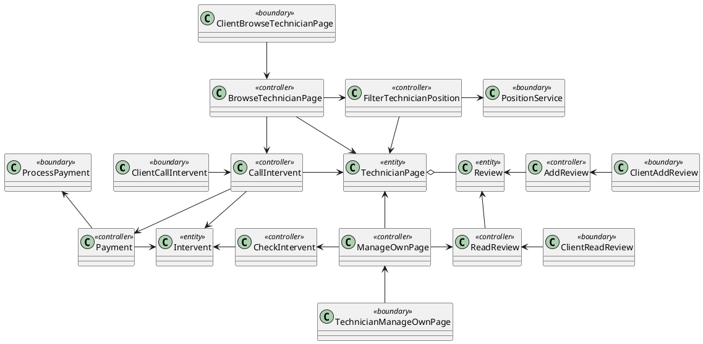

```plantuml
@startuml

class   ClientCallIntervent             <<boundary>>
class   CallIntervent                   <<controller>>
class   TechnicianPage                  <<entity>>
class   Payment                         <<controller>>
class   ProcessPayment                  <<boundary>>
class   ClientBrowseTechnicianPage      <<boundary>>
class   BrowseTechnicianPage            <<controller>>
class   FilterTechnicianPosition        <<controller>>
class   PositionService                 <<boundary>>
class   ManageOwnPage                   <<controller>>
class   TechnicianManageOwnPage         <<boundary>>
class   CheckIntervent                  <<controller>>
class   Intervent                       <<entity>>
class   ClientAddReview                 <<boundary>>
class   ClientReadReview                <<boundary>>
class   AddReview                       <<controller>>
class   Review                          <<entity>>
class   ReadReview                      <<controller>>

ClientReadReview -l-> ReadReview
ReadReview -up-> Review
ClientAddReview -l-> AddReview
AddReview -l-> Review
Review -l-o TechnicianPage
ClientCallIntervent -> CallIntervent
CallIntervent -> TechnicianPage
CallIntervent -d-> Payment
Payment -> Intervent
Payment -u-> ProcessPayment
ClientBrowseTechnicianPage -d-> BrowseTechnicianPage
BrowseTechnicianPage -> TechnicianPage
BrowseTechnicianPage -> CallIntervent
BrowseTechnicianPage -> FilterTechnicianPosition
FilterTechnicianPosition -d-> TechnicianPage
FilterTechnicianPosition -> PositionService
TechnicianManageOwnPage -u-> ManageOwnPage
ManageOwnPage -u-> TechnicianPage
ManageOwnPage -l-> CheckIntervent
ManageOwnPage -r-> ReadReview
CheckIntervent -l-> Intervent
CallIntervent -d-> Intervent

@enduml
```
