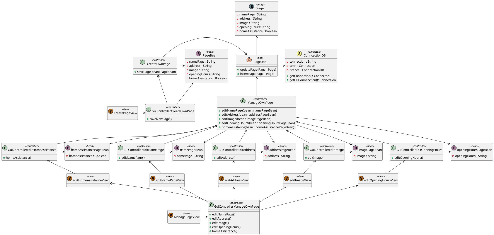

```plantuml
@startuml

class   CreatePageView             <<(V,#AF6A1F)view>>{
}

class   ManagePageView             <<(V,#AF6A1F)view>>{
}

class   GuiControllerCreateOwnPage             <<controller>>{
+saveNewPage()
}

class   GuiControllerManageOwnPage             <<controller>>{
+editNamePage()
+editAddress()
+editImage()
+editOpeningHours()
+homeAssistance()
}

class   editNamePageView             <<(V,#AF6A1F)view>>{
}
class   editAddressView             <<(V,#AF6A1F)view>>{
}
class   editImageView             <<(V,#AF6A1F)view>>{
}
class   editOpeningHoursView             <<(V,#AF6A1F)view>>{
}
class   editHomeAssistanceView             <<(V,#AF6A1F)view>>{
}

class   GuiControllerEditNamePage             <<controller>>{
+editNamePage()
}
class   GuiControllerEditAddress             <<controller>>{
+editAddress()
}
class   GuiControllerEditImage            <<controller>>{
+editImage()
}
class   GuiControllerEditOpeningHours           <<controller>>{
+editOpeningHours()
}
class   GuiControllerEditHomeAssistance             <<controller>>{
+homeAssistance()
}

class   CreateOwnPage             <<controller>>{
+savePage(bean: PageBean)
}

class   ManageOwnPage             <<controller>>{
+editNamePage(bean : namePageBean)
+editAddress(bean : addressPageBean)
+editImage(bean : imagePageBean)
+editOpeningHours(bean : openingHoursPageBean)
+homeAssistance(bean : homeAssistancePageBean)
}

class   PageBean             <<(B,#AA7E9F)bean>>{
-namePage : String
-address : String
-image : String
-openingHours: String
-homeAssistance : Boolean
}

class   homeAssistancePageBean             <<(B,#AA7E9F)bean>>{
-homeAssistance : Boolean
}
class   openingHoursPageBean             <<(B,#AA7E9F)bean>>{
-openingHours : String
}
class   imagePageBean             <<(B,#AA7E9F)bean>>{
-image : String
}
class   addressPageBean             <<(B,#AA7E9F)bean>>{
-address : String
}
class   namePageBean             <<(B,#AA7E9F)bean>>{
-namePage : String
}


class   Page             <<(E,#708a93)entity>>{
-namePage : String
-address : String
-image : String
-openingHours: String
-homeAssistance : Boolean
}

class   PageDao             <<(D,#FBBE9F)dao>>{
+updatePage(Page : Page)
+insertPage(Page : Page)
}

class   ConncectionDB             <<(S,#FFFF91)singleton>>{
-connection : String
-conn : Connection
-istance : ConncectionDB
+getConnection(): Connector
+getDBConnecction(): Connection
}

CreatePageView -> GuiControllerCreateOwnPage
GuiControllerCreateOwnPage -u-> PageBean
GuiControllerCreateOwnPage -> CreateOwnPage
CreateOwnPage -> PageBean
CreateOwnPage -> PageDao
PageDao -u-> Page
PageDao -> ConncectionDB

ManagePageView -> GuiControllerManageOwnPage
GuiControllerManageOwnPage -u-> editNamePageView
GuiControllerManageOwnPage -u-> editAddressView
GuiControllerManageOwnPage -u-> editImageView
GuiControllerManageOwnPage -u-> editOpeningHoursView
GuiControllerManageOwnPage -u-> editHomeAssistanceView

editOpeningHoursView -u-> GuiControllerEditOpeningHours
editImageView -u-> GuiControllerEditImage
editAddressView -u-> GuiControllerEditAddress
editNamePageView -u-> GuiControllerEditNamePage
editHomeAssistanceView -u-> GuiControllerEditHomeAssistance

GuiControllerEditOpeningHours -r-> openingHoursPageBean
GuiControllerEditImage -r-> imagePageBean
GuiControllerEditAddress -r-> addressPageBean
GuiControllerEditNamePage -r-> namePageBean
GuiControllerEditHomeAssistance -r-> homeAssistancePageBean

GuiControllerEditOpeningHours -u-> ManageOwnPage
GuiControllerEditImage -u-> ManageOwnPage
GuiControllerEditAddress -u-> ManageOwnPage
GuiControllerEditNamePage -u-> ManageOwnPage
GuiControllerEditHomeAssistance -u-> ManageOwnPage

ManageOwnPage -u-> openingHoursPageBean
ManageOwnPage -u-> imagePageBean
ManageOwnPage -u-> addressPageBean
ManageOwnPage -u-> namePageBean
ManageOwnPage -u-> homeAssistancePageBean

ManageOwnPage -u-> PageDao

@enduml
```