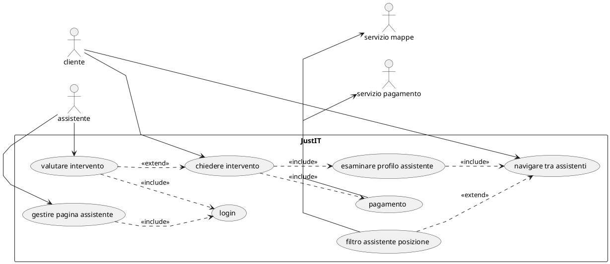

```plantuml
@startuml
left to right direction
skinparam packageStyle rectangle
skinparam linetype polyline

together {
actor "cliente" as c
actor "assistente" as a
}

together {
actor "servizio mappe" as sm
actor "servizio pagamento" as sp
}

rectangle "JustIT" {

  c -> (navigare tra assistenti)
  c -> (chiedere intervento)


  (esaminare profilo assistente) ..> (navigare tra assistenti) : <<include>>
  (chiedere intervento) ..> (esaminare profilo assistente) : <<include>>
  (chiedere intervento) ..> (pagamento) : <<include>>
  (filtro assistente posizione) ..> (navigare tra assistenti) : <<extend>>

  a -> (valutare intervento)
  (valutare intervento) ..> (chiedere intervento) : <<extend>>
  a -> (gestire pagina assistente)
  (gestire pagina assistente) ..> (login) : <<include>>
  (valutare intervento) ..> (login) : <<include>>

  (filtro assistente posizione) -> sm
  (pagamento) -> sp

}

@enduml
```
