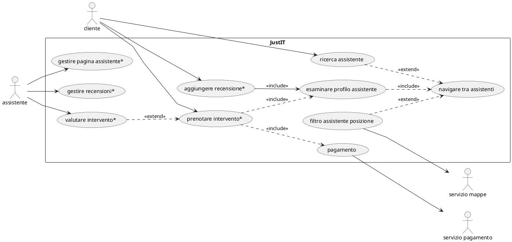

```plantuml
@startuml
left to right direction
skinparam packageStyle rectangle
skinparam linetype polyline


actor "cliente" as c
actor "assistente" as a


actor "servizio mappe" as sm
actor "servizio pagamento" as sp

package JustIT {

  c -> (prenotare intervento*)
  c -d-> (aggiungere recensione*)
  c -d-> (ricerca assistente)

  (ricerca assistente) ..> (navigare tra assistenti) : <<extend>>
  (esaminare profilo assistente) ..> (navigare tra assistenti) : <<include>>
  (prenotare intervento*) ..> (esaminare profilo assistente) : <<include>>
  (prenotare intervento*) ..> (pagamento) : <<include>>
  (filtro assistente posizione) ..> (navigare tra assistenti) : <<extend>>

  a -d-> (valutare intervento*)
  (valutare intervento*) ..> (prenotare intervento*) : <<extend>>
  a -r-> (gestire pagina assistente*)
  (filtro assistente posizione) -d-> sm
  (pagamento) -d-> sp
  (aggiungere recensione*) --> (esaminare profilo assistente) : <<include>>
  a -> (gestire recensioni*)

}
@enduml
```
